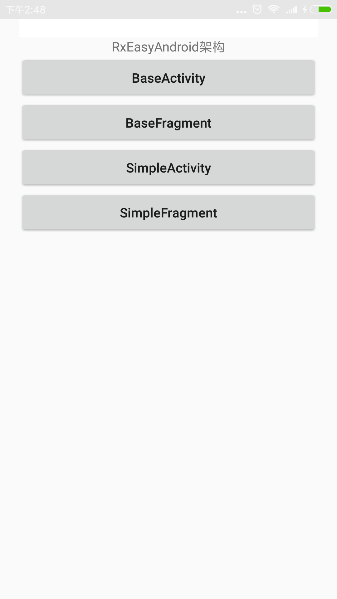
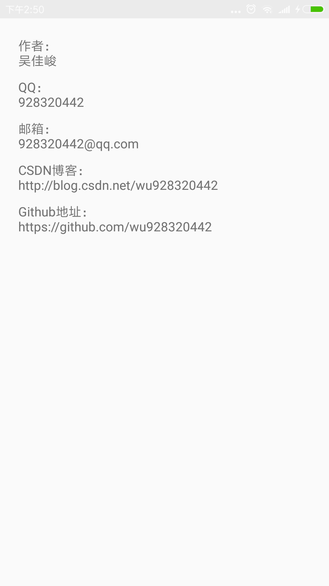

# 需要的环境
* JDK1.7
* SDK
* AndroidStudio开发工具

# 特性
* 整合主流HTTP网络（Retrofit2、OKHTTP3）、图片加载（Glide）、MVP（RxJava2＋Dagger2）架构的一套快速高效的开发框架
* 包含app library 两个Module 组件化开发
* 在EasyAndroid基础上加入RxJava2支持 这个是非RxJava2版本https://github.com/wu928320442/EasyAndroid

# 用到的第三方框架
* SDK自带扩展依赖包
* RxJava2
* RxBus封装（基于RxJava2）
* Retrofit2网络层处理 使用OKHTTP3处理
* Glide图片加载处理 使用OKHTTP3处理
* OKHTTP3  HTTP基础库，提供给网络层处理和图片加载
* PersistentCookieJar快速Cookie持久化与缓存库
* Dagger2 依赖注入库，整合Activity，Fragment，Presenter之间的依赖关系
* Butterknife View的注入库
* BaseRecyclerViewAdapterHelper Recycler下拉加载库
* statusbarutil 状态栏管理
* Utilcode实用工具库
* Logger 一个简洁漂亮的日志打印库

# 联系方式
* **QQ** 928320442
* **Android开发交流群** 323876830
* **Email** wujiajun311@gmail.com
